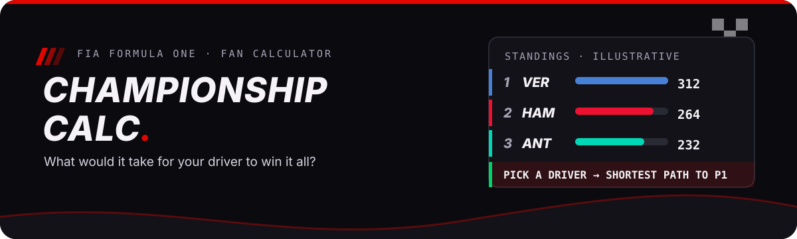

<p align="center">
  
</p>

# f1-championship-calc

**What would it take for your driver to win the F1 title?** A fan calculator that takes the current standings plus the remaining rounds and answers exactly that — for drivers and constructors.

## Try it on any contender

Pick a driver — say Norris in P4 — and the solver answers the shortest path to the top: how many points and wins it takes, and which finishes get there. The scenario builder then lets you assign those finishes round by round and watch the projected table move, including head-to-head finishes.

## What it does

- **Standings** — drivers and constructors from the latest snapshot, with team-colour rows.
- **Points still available** — GP / sprint / fastest-lap boxes for the undecided rounds.
- **What would it take** — least-effort solver: fewest contender points that reach a target position.
- **Scenario builder** — assign finishing orders to the remaining rounds (bulk or per-round fine-tune) and watch the projected table move, including head-to-head finishes.
- **Clinch math** — who is mathematically certain, still alive, or eliminated on points.

## How it works

`scripts/snapshot.mjs` pulls standings and calendars from f1api.dev, OpenF1, and Jolpica into `src/data/snapshot.json`. Pure functions in `src/lib/championship.ts` do the math (`availablePoints`, `leastEffortPath`, `projectStandings`, `clinchState`); `src/components/Calculator.astro` renders the Astro UI. Data refreshes weekly via `.github/workflows/refresh.yml` (Mondays 06:00 UTC, plus manual runs after a race).

Glossary: **standings** (points table) · **scenario** (your assigned finishes for remaining rounds) · **clinch** (mathematically certain regardless of other outcomes) · **round** (one Grand Prix weekend, optionally with a sprint).

## Run it

```bash
pnpm install
pnpm dev        # local app
pnpm snapshot   # refresh src/data/snapshot.json
pnpm test       # championship + solver tests
pnpm build
```

## Limits

Unofficial fan project, not affiliated with Formula 1. Clinch math is points-only (wins break display ties, not clinch math). Driver photos via the F1 CDN / OpenF1.

## License

MIT — see [LICENSE](./LICENSE).
